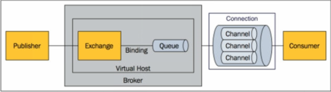

## 消息机制
* 点对点式
    > 消息只有唯一的发送者和接受者
* 发布式订阅
    > 发送者发送消息到主题，多个接收者监听订阅这个主题
## 消息服务规范
* JMS
    * java消息服务
    * 基于JVM消息代理的规范
    * ActiveMQ、HornetMQ是JMS实现
* AMQP
    * 高级消息队列协议，兼容JMS
    * RabbitMQ是AMQP实现
    * 跨平台
## RabbitMQ
### 核心概念
* Message : 消息头和消息体组成
    * 消息头
        * routing-key（路由键）
        * priority（相当于其他消息的优先权）
        * delivery-mode（是否需要持久性存储）
        * ...
* Publisher : 消息生产者
    > 向交换器发布消息的客户端应用程序
* Exchange : 交换器
    * 用来接受生产者发送的消息并将这些消息路由给服务器中的队列
    * Exchange的4种类型
        * direct（default）
        * fanout
        * topic
        * headers
* Queue 消息队列
    > 用来保存消息知道发送给消费者。他是消息的容器，
      也是消息的终点。一个消息可以投入一个或多个队列。
      消息一直在队列里面，等待消费者连接到这个队列将其取走  
* Binding 绑定
    > 用于消息队列和交换器之间的关联，一个绑定就是基于路由键
    将交换器和消息队列连接起来的路由规则，所以可将交换器理解
    成一个绑定构成的路由表。Exchange和Queue的绑定可以是多对多关系。
* Connection 网络连接
* Channel 信道
    > 多路复用连接中的一条独立的双向数据流通道。信道是建立在真是的
    TCP连接内的虚拟连接，AMRQ命令都是通过信道发出去的。
* Consumer 消费者
* Virtual Host 虚拟主机
    > 表示一批交换器、消息队列和相关对象。虚拟主机是共享相同的身份认证
    和加密环境的独立服务器域。每个vhost本质上就是一个mini版的RabbitMQ
    服务器，拥有自己的队列、交换器、绑定和权限机制。vhost是AMRQ概念的
    基础，必须在连接是指定RabbitMQ默认的vhost是/。
* Broker 表示消息队列服务器实体
    > 
### RabbitMQ运行机制
    
    
    
    
    
    
    
    
    
    
    
    
    
    
    